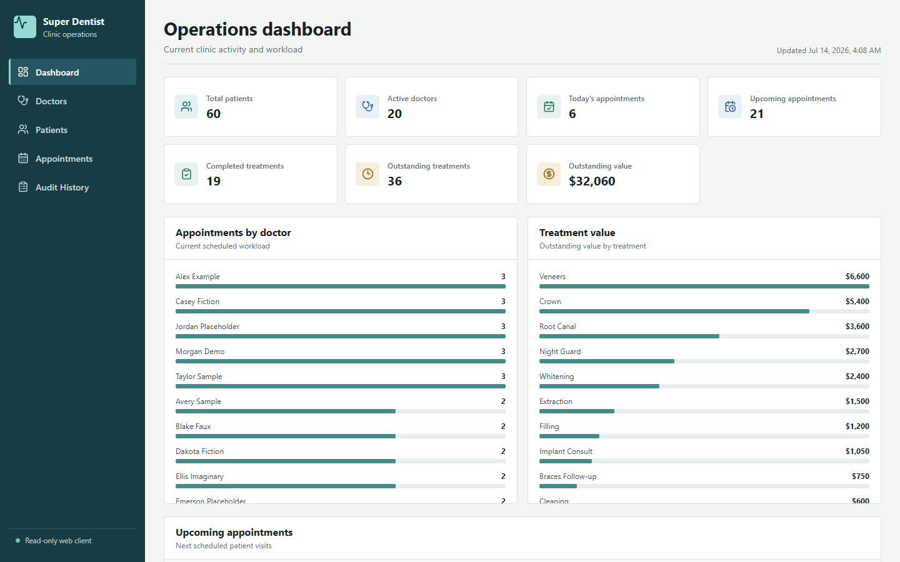
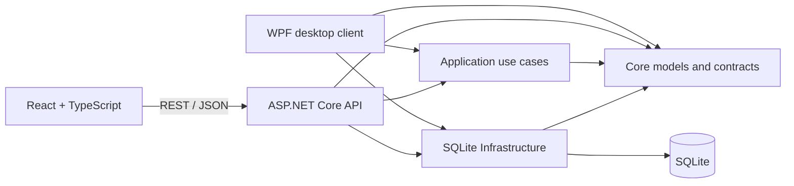
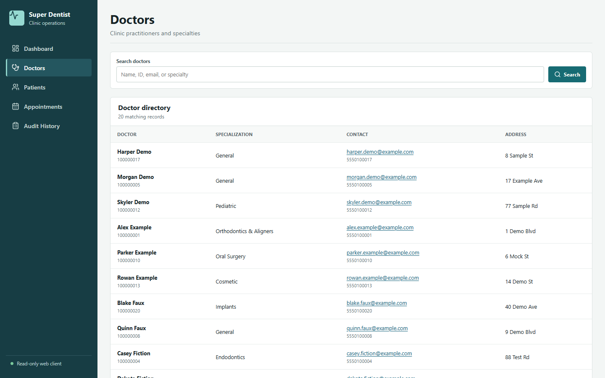
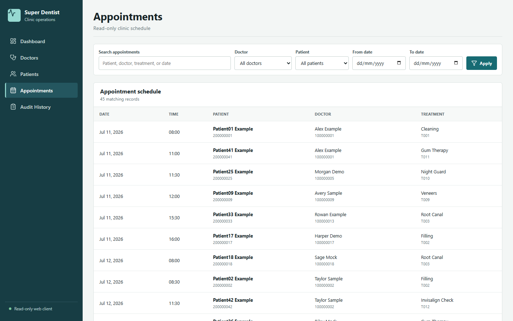
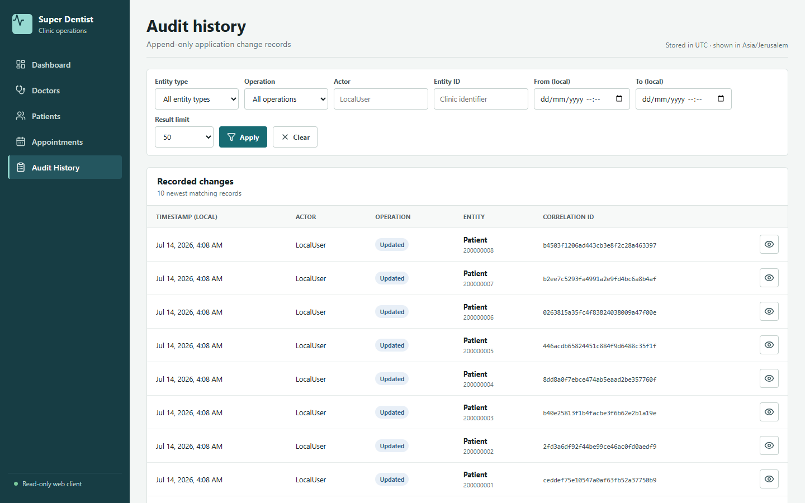
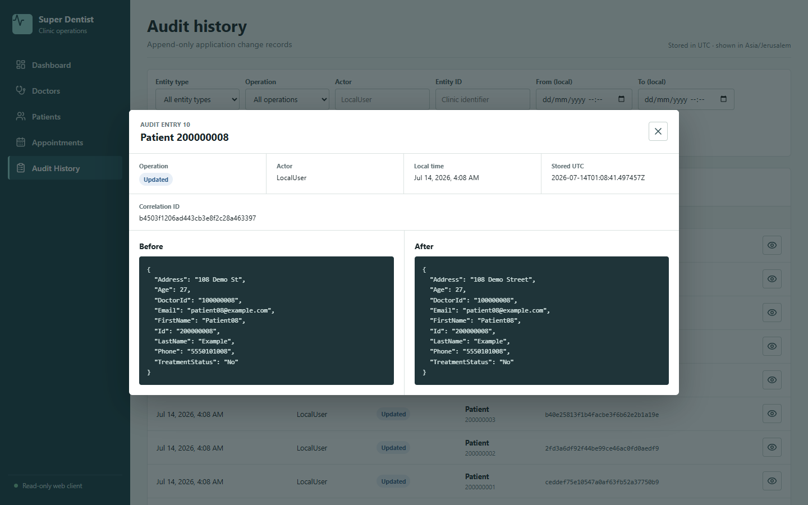
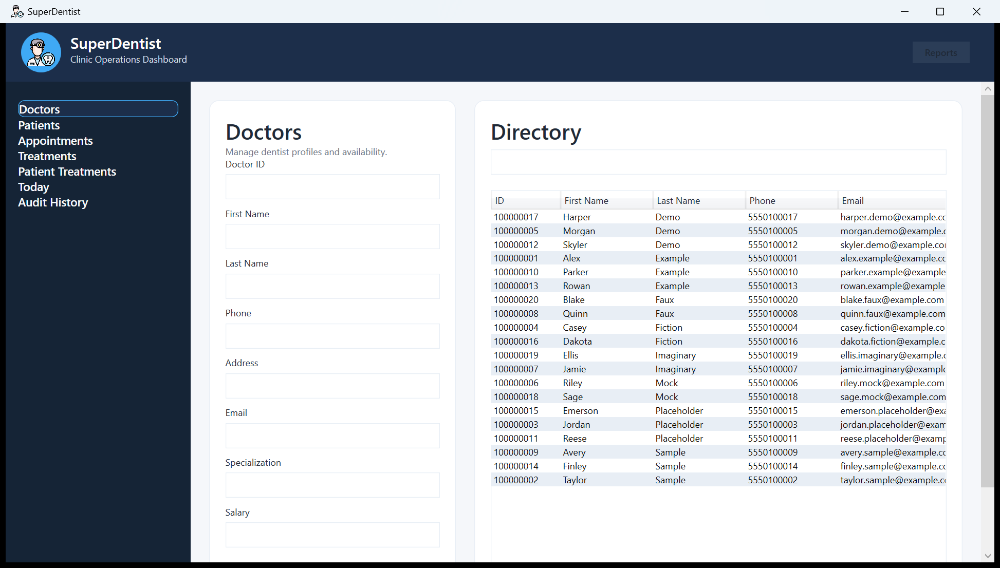
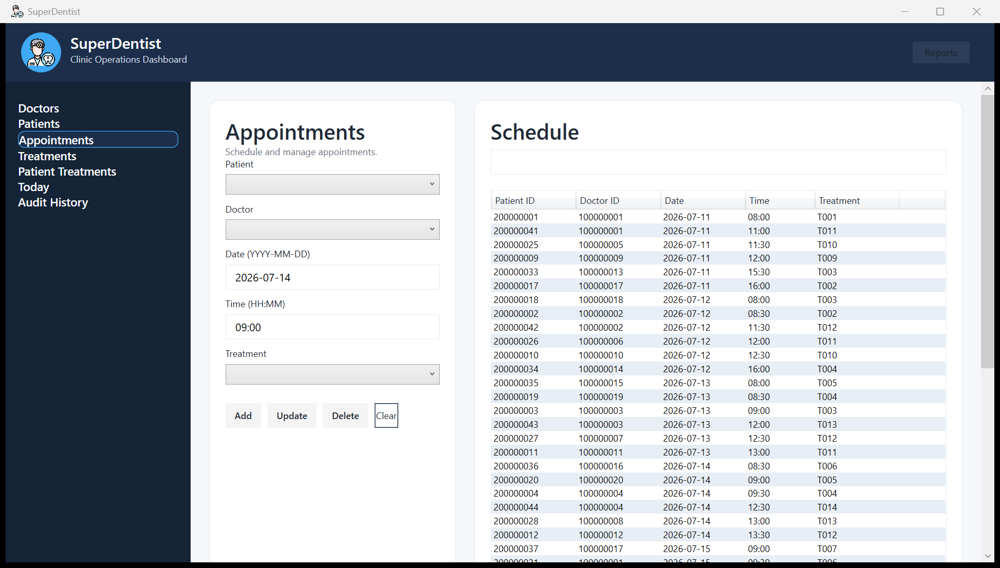
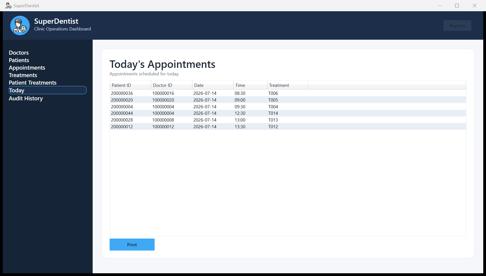
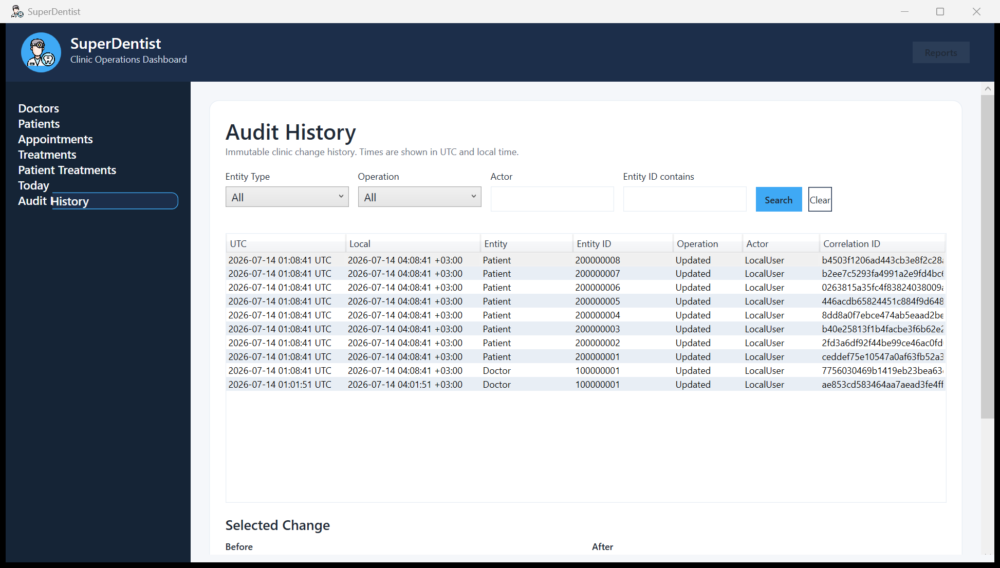

# Super Dentist

[](https://github.com/swarka7/super-dentist-clinic-app/actions/workflows/ci.yml)

Super Dentist is a full-stack clinic-management system. A .NET 8 WPF desktop client owns clinic write workflows, while a read-only React dashboard consumes an ASP.NET Core reporting API. The WPF and API composition roots reuse the same Application, Core, Infrastructure, and SQLite implementation.



The repository demonstrates a layered desktop and web system in a local, trusted environment. It uses synthetic seeded records only; it is not presented as a deployed or compliance-certified healthcare product.

## What The System Does

The WPF client supports:

- doctor, patient, treatment, appointment, and patient-treatment management;
- appointment conflict checks;
- operational reports and printing;
- field validation and user-facing error handling;
- read-only audit-history search and before/after inspection.

The web client supports read-only operational review:

- clinic summary metrics and upcoming appointments;
- searchable, bounded doctor and patient lists;
- appointment filtering by text, doctor, patient, and date range;
- newest-first audit search with formatted before/after JSON.

The API exposes only read endpoints. The WPF client remains the only clinic write client.

## Architecture



Dependency rules enforced by project references:

- `SuperDentist.Core` has no project dependencies.
- `SuperDentist.Application` depends only on Core.
- `SuperDentist.Infrastructure` depends only on Core.
- `SuperDentist.App` and `SuperDentist.Api` are separate composition roots.
- `SuperDentist.Web` communicates only with the API and has no database access.

See [docs/ARCHITECTURE.md](docs/ARCHITECTURE.md) for request, transaction, migration, audit, and testing flows.

## Engineering Features

- MVVM desktop client using `CommunityToolkit.Mvvm` and dependency injection.
- Application-owned business services, bounded list queries, and dashboard aggregation.
- Repository contracts in Core with parameterized SQLite implementations in Infrastructure.
- Versioned, ordered SQLite migrations with transactional application and recovery of interrupted baseline adoption.
- Foreign-key enforcement on every opened connection and restrictive delete policies.
- Atomic entity mutation and application audit insertion through one connection and transaction.
- Append-only audit storage guarded by repository contracts and SQLite triggers.
- Deterministic, key-ordered JSON audit snapshots and replaceable current-actor abstraction.
- Dedicated API response DTOs, validation problem responses, sanitized exception handling, health checks, Swagger, and structured request logging.
- Centralized typed frontend API client with cancellation, retryable errors, bounded paging, and safe malformed-JSON display.
- Isolated temporary SQLite integration tests plus SQLite-free Application unit tests.
- Independent backend and frontend GitHub Actions jobs with published verification artifacts.

## Technology Stack

| Area | Technology |
| --- | --- |
| Desktop | .NET 8, WPF, MVVM, CommunityToolkit.Mvvm |
| API | ASP.NET Core controllers, OpenAPI/Swagger, health checks |
| Web | React, TypeScript, Vite, React Router, Lucide icons |
| Application | C# services, explicit query/response models, dependency injection |
| Persistence | SQLite, parameterized SQL, custom lightweight migrations |
| Logging | Serilog for WPF; structured JSON console logging for the API |
| Backend tests | xUnit, ASP.NET Core `WebApplicationFactory`, temporary SQLite databases |
| Frontend tests | Vitest, Testing Library, jsdom |
| Automation | PowerShell, Node.js, GitHub Actions |

## Project Structure

```text
src/
  SuperDentist.App/             WPF UI, ViewModels, navigation, validation, composition root
  SuperDentist.Api/             Read-only HTTP boundary, DTOs, Swagger, health, API composition root
  SuperDentist.Web/             React dashboard, routes, typed API client, frontend tests
  SuperDentist.Application/     Business use cases, queries, dashboard and audit services
  SuperDentist.Core/            Domain models, repository/service/transaction contracts
  SuperDentist.Infrastructure/  SQLite connections, repositories, migrations, transactions, seeding
tests/
  SuperDentist.Tests/           Backend unit, persistence, transaction, migration, and API tests
scripts/                         Development launchers and verification scripts
docs/screenshots/               Current web and desktop captures from seeded demo data
.github/workflows/ci.yml         Backend and frontend continuous integration
```

`SuperDentist.App` is the WPF project. Its branded assembly and executable are named `Super Dentist`, so a local build produces `Super Dentist.exe`.

## Prerequisites

- .NET SDK `8.0.417` or a compatible feature-band SDK selected by `global.json`.
- Node.js `22.14.0` as recorded in `.nvmrc`.
- Windows 10/11 for the WPF client. The API and React development client are cross-platform.

## Quick Start

Install dependencies once from the repository root:

```powershell
dotnet restore "Super Dentist.sln"
Push-Location src/SuperDentist.Web
npm ci
Pop-Location
```

Start the API and React development server together on Windows:

```powershell
powershell -NoProfile -ExecutionPolicy Bypass -File .\scripts\start-dev.ps1
```

Cross-platform launcher:

```shell
node scripts/start-dev.mjs
```

Both launchers verify their required tools, build the API, start only the API and Vite processes they own, wait for readiness, and stop those child processes on exit. They do not search for or terminate unrelated processes.

Development URLs:

- Dashboard: `http://localhost:5173`
- API: `http://localhost:5080`
- Swagger: `http://localhost:5080/swagger`
- Health: `http://localhost:5080/health`

## Manual Startup

Start the API from the repository root:

```powershell
dotnet run --project src/SuperDentist.Api/SuperDentist.Api.csproj
```

Start the web client in a second terminal:

```powershell
Set-Location src/SuperDentist.Web
npm run dev
```

Start the WPF write client on Windows:

```powershell
dotnet run --project src/SuperDentist.App/SuperDentist.App.csproj
```

The API and WPF client use the same default database path. To select a neutral local database explicitly for either process, set `SUPERDENTIST_DB_PATH` before launch:

```powershell
$env:SUPERDENTIST_DB_PATH = Join-Path $PWD "superdentist-demo.db"
```

Database files are ignored by Git. The default path is `%LOCALAPPDATA%\SuperDentist\superdentist.db`; WPF logs default to `%LOCALAPPDATA%\SuperDentist\logs\superdentist.log`.

## Frontend Configuration

The typed client defaults to `http://localhost:5080`. Override it at development/build time with `VITE_API_BASE_URL`. The committed [`src/SuperDentist.Web/.env.example`](src/SuperDentist.Web/.env.example) contains the non-secret local value; local `.env` files are ignored.

Development CORS is enabled only for origins listed in `src/SuperDentist.Api/appsettings.Development.json`, currently `http://localhost:5173`. Production does not register a permissive fallback policy. CORS is a browser boundary, not authentication.

A static host for a production frontend build must route unknown paths to `index.html` so direct React routes refresh correctly.

## Verification

Run the complete repository verification on Windows:

```powershell
powershell -NoProfile -ExecutionPolicy Bypass -File .\scripts\verify-all.ps1
```

Backend verification:

```powershell
dotnet restore "Super Dentist.sln"
dotnet build "Super Dentist.sln" -c Release --no-restore -warnaserror
dotnet test "Super Dentist.sln" -c Release --no-build --no-restore
```

The same backend sequence is available as:

```powershell
powershell -NoProfile -ExecutionPolicy Bypass -File .\scripts\verify-backend.ps1
```

Frontend verification from `src/SuperDentist.Web`:

```powershell
npm ci
npm run typecheck
npm run lint
npm test
npm run build
```

The same frontend sequence is available as:

```powershell
powershell -NoProfile -ExecutionPolicy Bypass -File .\scripts\verify-frontend.ps1
```

Backend tests use deterministic test-owned data and isolated temporary databases initialized by the production migration mechanism. Application service and dashboard tests also use simple fakes to prove they can run without SQLite. Frontend tests mock the centralized API boundary and exercise loading, success, empty, retry, filtering, pagination, audit inspection, and modal keyboard behavior.

## Continuous Integration

[`.github/workflows/ci.yml`](.github/workflows/ci.yml) runs on pushes to `main`, pull requests targeting `main`, and manual dispatches.

- Backend job: Windows, cached NuGet restore, warning-as-error Release build, .NET tests, and published API artifact.
- Frontend job: Linux, cached lockfile install, type checking, linting, one-shot tests, production build, and published `dist` artifact.

The workflow has read-only repository permissions and no deployment credentials or deployment step.

## API Surface

| Endpoint | Purpose |
| --- | --- |
| `GET /api/doctors` | Bounded search and paging |
| `GET /api/doctors/{id}` | Single doctor or 404 |
| `GET /api/patients` | Bounded search, doctor filter, and paging |
| `GET /api/patients/{id}` | Single patient or 404 |
| `GET /api/appointments` | Bounded text, identifier, and date-range filtering |
| `GET /api/treatments` | Bounded treatment search and paging |
| `GET /api/audit` | Bounded, combinable audit filters ordered newest first |
| `GET /api/dashboard/summary` | Operational metrics and bounded breakdowns |
| `GET /health` | API and SQLite availability |

The API maps to dedicated DTOs. Doctor salary is not present in doctor responses. Unexpected failures return generic Problem Details without stack traces or internal exception messages, and request logging omits query strings.

## Transactions And Audit

Successful create, update, and delete operations for doctors, patients, treatments, appointments, and patient treatments append exactly one audit entry. Each audited operation uses an Infrastructure-owned transaction:

```text
WPF command
  -> Application service and business checks
  -> entity read/mutation and AuditService append
  -> one SQLite connection and transaction
  -> commit, or rollback on persistence/audit failure
```

Update snapshots are built from the stored record before the change and the reloaded persisted record afterward. Create snapshots have no old value; delete snapshots have no new value. Entries record entity type, identifier, operation, `LocalUser`, UTC timestamp, deterministic JSON snapshots, and a correlation ID.

`LocalUser` is a replaceable application actor label, not verified identity. `IAuditRepository` exposes add/search only, while SQLite triggers reject direct audit updates and deletes. There is no audit retention or archival policy.

## Database Migrations

Infrastructure tracks versions in `SchemaMigrations` and currently applies:

1. Baseline clinic schema.
2. Foreign keys, restrictive update/delete policies, and `CreatedAtUtc` / `UpdatedAtUtc` columns.
3. Append-only audit table, query indexes, and update/delete rejection triggers.

New and existing databases use the same ordered migration runner. Each migration obtains a write transaction, rechecks whether its version was applied, executes schema SQL and integrity checks, then records the version only before committing. Migration-history creation and adoption of an existing unversioned baseline are atomic, including recovery from an empty history table left by an interrupted older startup.

Initialization never deletes the database file. An unversioned legacy database must contain all baseline tables, and existing relationships must satisfy the new foreign keys; incompatible data causes startup to fail with logs instead of being discarded. Existing rows receive UTC timestamps during version 2. Demo seeding runs only after all migrations succeed and only when no doctors exist.

All opened SQLite connections execute `PRAGMA foreign_keys = ON`. Patient-to-doctor, appointment, and patient-treatment relationships use `ON UPDATE RESTRICT` and `ON DELETE RESTRICT` to avoid silent loss of referenced clinic records.

## Screenshots

All captures below come from the real applications using one fresh, ignored, seeded `superdentist-demo.db`.

### Web Dashboard

| Doctors | Appointments |
| --- | --- |
|  |  |

| Audit history | Audit details |
| --- | --- |
|  |  |

Additional web capture: [patient directory](docs/screenshots/web/patients.png).

### WPF Desktop

| Doctors | Appointments |
| --- | --- |
|  |  |

| Today | Audit history |
| --- | --- |
|  |  |

Additional desktop captures: [patients](docs/screenshots/desktop/patients.png), [treatments](docs/screenshots/desktop/treatments.png), [patient treatments](docs/screenshots/desktop/patient-treatments.png), and [reports](docs/screenshots/desktop/reports.png).

## Security And Environment Scope

This repository is intended for local, trusted-environment demonstration:

- no authentication or authorization protects the API or dashboard;
- `LocalUser` is not a secure identity;
- patient and audit endpoints expose synthetic clinic data to any client that can reach the API;
- SQLite files and WPF logs are local and are not encrypted, backed up, or centrally monitored by this repository;
- no claims are made about healthcare regulatory compliance;
- development CORS restrictions do not replace access control.

Do not use real patient information with the current configuration.

## Current Limitations

- Repository contracts load complete entity collections before Application filtering and paging; HTTP responses are bounded, but database work is not.
- SQLite fits the current single-clinic/local-write model and is not intended for horizontally scaled writers.
- Appointment date and time values remain legacy strings, and dashboard "today" semantics use the API host's local date because no clinic time-zone setting exists.
- Dashboard currency presentation assumes USD because the domain has no currency configuration.
- The React client and API are read-only; write workflows require Windows and the WPF client.
- Audit storage has no retention, export, or archival policy.
- CI verifies and publishes build artifacts but does not deploy an environment.

## Reasonable Future Improvements

- Add authenticated users and role-based authorization through the existing actor abstraction.
- Move bounded list filtering, projections, and counts into persistence queries for larger datasets.
- Replace legacy date/time strings with explicit clinic time-zone semantics through a versioned migration.
- Add clinic-level currency configuration rather than a frontend assumption.
- Define backup, restore, audit-retention, and operational recovery procedures.
- Add browser end-to-end smoke checks to CI against an ephemeral demo database.
