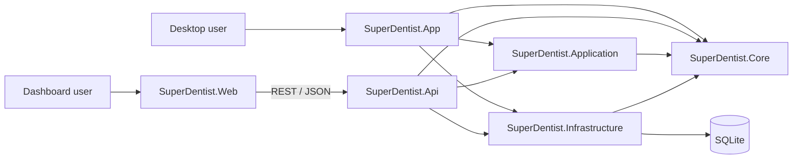
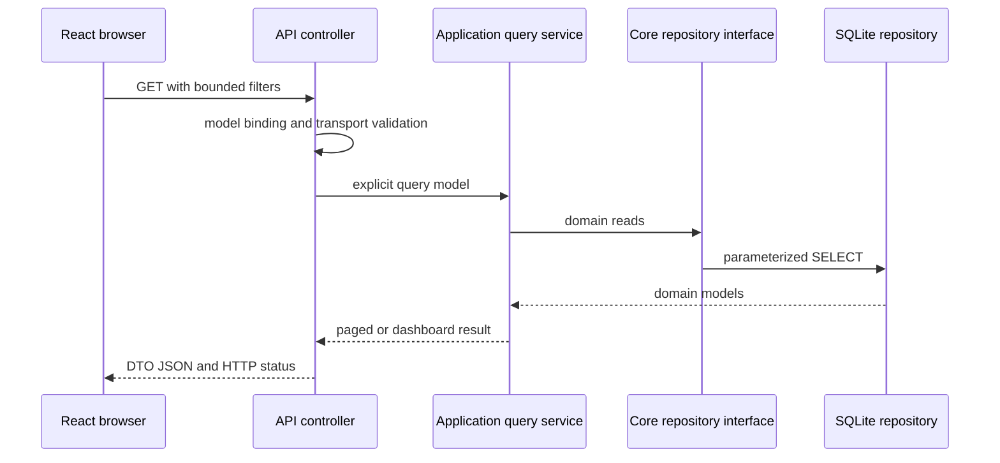
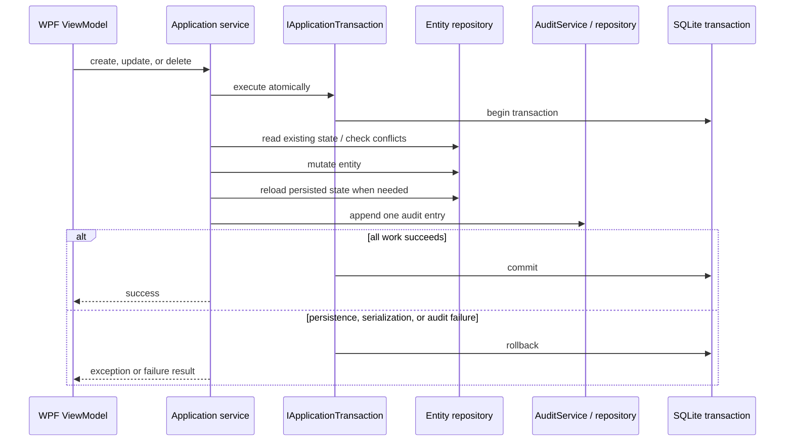

# Architecture

Super Dentist is a layered clinic-management portfolio project with two presentation clients:

- a WPF desktop client for clinic write workflows and reports;
- a React dashboard for read-only operational review through an ASP.NET Core API.

Both .NET composition roots reuse the same Application, Core, and SQLite Infrastructure projects. The React client has no direct .NET or database dependency.

## System Context



Desktop flow:

```text
WPF View / ViewModel
  -> Core service contract
  -> Application service
  -> Core repository and transaction contracts
  -> SQLite Infrastructure
```

Web flow:

```text
React route
  -> centralized typed API client
  -> ASP.NET Core controller
  -> Application query/service
  -> Core repository contracts
  -> SQLite Infrastructure
```

The web flow is read-only. The desktop client owns all current clinic mutations.

## Project Responsibilities

### `SuperDentist.Core`

Core contains domain and cross-layer contracts:

- `Doctor`, `Patient`, `Treatment`, `Appointment`, and `PatientTreatment` models;
- `AuditEntry`, `AuditOperation`, audit entity names, and `AuditQuery`;
- repository, service, actor-provider, and application-transaction interfaces;
- operation results and database options.

Core has no project reference to Application, Infrastructure, WPF, ASP.NET Core, or React.

### `SuperDentist.Application`

Application implements reusable use cases:

- doctor, patient, treatment, appointment, and patient-treatment services;
- appointment identity and doctor-slot conflict checks;
- audited create, update, and delete workflows;
- deterministic audit snapshot serialization and actor/correlation handling;
- bounded clinic list filtering and paging;
- dashboard aggregation and explicit query/response models.

Application depends on Core abstractions. It contains no SQLite SQL, WPF type, ASP.NET Core type, or frontend concern.

### `SuperDentist.Infrastructure`

Infrastructure implements technical persistence:

- SQLite connection creation and foreign-key activation;
- async-flow-aware transaction scopes;
- parameterized repository SQL and persistence mapping;
- ordered schema migrations and schema history;
- database initialization and synthetic demo seeding;
- append-only audit persistence.

Infrastructure depends on Core contracts and has no Application or presentation-project reference.

### `SuperDentist.App`

The WPF project is a Windows composition root and client:

- Views, ViewModels, DataTemplates, navigation, and commands;
- `ObservableValidator` field validation and inline error display;
- printing and desktop message services;
- Serilog configuration;
- Application and Infrastructure DI registration;
- migration/initialization before the main window is shown.

`SuperDentist.App` is the project name. Its branded assembly and executable are `Super Dentist.dll` and `Super Dentist.exe`.

### `SuperDentist.Api`

The API is a second .NET composition root and HTTP boundary:

- controller-based read endpoints;
- dedicated HTTP response DTOs and mapping;
- model-binding validation and Problem Details responses;
- centralized exception handling;
- structured request logging;
- development Swagger and narrow CORS;
- SQLite health check;
- Application and Infrastructure DI registration and startup initialization.

Controllers bind and validate transport input, delegate to Application services, map results, and choose HTTP responses. Reusable filtering and dashboard calculations do not live in controllers.

### `SuperDentist.Web`

The React/Vite client contains presentation and browser interaction logic:

- dashboard, doctor, patient, appointment, and audit routes;
- responsive navigation, tables, filters, status badges, and CSS bar visualizations;
- centralized typed API calls and ASP.NET Problem Details conversion;
- request cancellation, loading, empty, retry, and controlled error states;
- local date/time and currency formatting;
- read-only audit modal with safe JSON fallback and contained keyboard focus.

Page components do not issue raw `fetch` calls and contain no clinic mutation rules.

### `SuperDentist.Tests`

The xUnit project covers Application services, SQLite behavior, transactions, migrations, audit invariants, dashboard aggregation, and the in-process API host. Frontend tests live with `SuperDentist.Web` and exercise route behavior through a mocked API boundary.

## Dependency Direction

```text
SuperDentist.App             -> Application, Infrastructure, Core
SuperDentist.Api             -> Application, Infrastructure, Core
SuperDentist.Application     -> Core
SuperDentist.Infrastructure  -> Core
SuperDentist.Core            -> no solution project
SuperDentist.Web             -> HTTP only
```

Application and Infrastructure are siblings. Application requests repositories and transactions through Core interfaces; composition roots select the SQLite implementations. There is no circular project dependency.

## Dependency Injection And Startup

WPF startup:

1. `App` builds a generic host and loads optional `appsettings.json`.
2. Application services and Infrastructure repositories are registered.
3. Serilog is configured for debug and rolling local file output.
4. `IDatabaseInitializer` runs migrations and optional demo seeding.
5. `MainWindow` is resolved and shown only after successful initialization.

API startup:

1. `WebApplicationBuilder` loads configuration.
2. Application and Infrastructure modules are registered.
3. Controllers, Problem Details, exception handling, health checks, Swagger, and development CORS are configured.
4. `IDatabaseInitializer` completes before routes begin serving.
5. Request logging and the HTTP pipeline are activated.

Initialization failures are logged and stop startup. Neither composition root silently deletes or recreates a database file.

## API Request Flow



### Endpoints

| Endpoint | Application path | Bounds and filters |
| --- | --- | --- |
| `GET /api/doctors` | `IClinicQueryService` | search, `limit` 1-200, nonnegative offset |
| `GET /api/doctors/{id}` | `IDoctorService` | 200 or 404 |
| `GET /api/patients` | `IClinicQueryService` | search, doctor ID, bounded paging |
| `GET /api/patients/{id}` | `IPatientService` | 200 or 404 |
| `GET /api/appointments` | `IClinicQueryService` | search, doctor/patient IDs, date range, bounded paging |
| `GET /api/treatments` | `IClinicQueryService` | search and bounded paging |
| `GET /api/audit` | `IAuditService` | entity, partial entity ID, actor, operation, UTC range, limit 1-200 |
| `GET /api/dashboard/summary` | `IDashboardQueryService` | each breakdown limited to 1-50 |
| `GET /health` | SQLite health check | 200 healthy or 503 unhealthy |

API entities are mapped to response DTOs. Doctor responses intentionally omit salary. Invalid transport input returns HTTP 400 validation Problem Details. Missing single resources return 404. Unexpected exceptions are logged with a trace ID and returned as generic HTTP 500 Problem Details without exception messages or stack traces.

Request logs contain method, path, status, duration, and trace ID. Query strings are omitted so filter values are not copied into routine request events.

Swagger is enabled only in Development. Development CORS reads an explicit origin list and permits GET methods; it defaults to `http://localhost:5173`. CORS is not an access-control mechanism.

## React Client Flow

```text
Route page
  -> useAsyncResource
  -> clinicApi
  -> getJson
  -> SuperDentist.Api
```

`clinicApi` is the single frontend API boundary. It owns endpoint paths, query serialization, response types, and `AbortSignal` forwarding. `getJson` converts ASP.NET Problem Details and network failures into consistent `ApiError` instances.

The frontend provides:

- dashboard metrics, bounded upcoming visits, doctor workload, treatment value, and recent audit activity;
- API-backed search, combined filters, and paging;
- safe display values for missing data;
- UTC audit storage labels with browser-local display;
- formatted valid audit JSON and plain-text fallback for malformed legacy values;
- visible keyboard focus and a focus-contained, Escape-close audit dialog;
- table-local horizontal scrolling and responsive desktop, tablet, and mobile navigation.

Vite supplies `VITE_API_BASE_URL`; the default is `http://localhost:5080`. Direct routes work in Vite development. A production static host must provide an `index.html` fallback.

## Persistence

The default database is `%LOCALAPPDATA%\SuperDentist\superdentist.db`. Resolution order is:

1. `SUPERDENTIST_DB_PATH` environment variable;
2. configured `Database:Path`;
3. the default local application-data path.

`SqliteConnectionFactory` opens each connection in read/write/create mode and immediately executes:

```sql
PRAGMA foreign_keys = ON;
```

Repository commands are parameterized. Readers, commands, scopes, transactions, and connections are disposed with `using` or `await using`.

## Schema Migrations

`SchemaMigrations` records version, name, and UTC application timestamp. The current schema version is 3:

1. Baseline clinic tables and appointment uniqueness indexes.
2. Foreign keys plus `CreatedAtUtc` and `UpdatedAtUtc` columns on mutable clinic entities.
3. `AuditEntries`, audit query indexes, and append-only update/delete triggers.

Migration behavior:

- migration definitions are ordered by integer version;
- migration-history initialization uses an immediate SQLite transaction;
- an existing unversioned baseline and its version-1 record are adopted atomically;
- an empty history table beside a complete baseline is repaired and adopted safely;
- each migration obtains an immediate transaction and rechecks its version under the write lock;
- concurrent initializers therefore skip a version another process committed instead of applying it twice;
- SQL, foreign-key integrity checks, and version recording share the transaction;
- a failed migration rolls back and is not recorded;
- startup stops and logs the migration version/name on failure.

Version 2 rebuilds tables inside its transaction to add constraints; it does not delete or replace the database file. Existing rows are copied and receive valid UTC timestamp values. Legacy empty nullable references are normalized to `NULL`. Missing baseline tables or invalid legacy relationships block upgrade instead of causing data loss.

Demo seeding starts only after migrations complete and only when the Doctors table is empty. Initialization is idempotent and does not modify existing audit entries.

## Foreign Keys And Delete Policies

Relationships protected by SQLite constraints:

- Patient -> Doctor
- Appointment -> Patient
- Appointment -> Doctor
- Appointment -> Treatment
- PatientTreatment -> Patient
- PatientTreatment -> Treatment

All use `ON UPDATE RESTRICT` and `ON DELETE RESTRICT`. This prevents silent cascading loss of referenced scheduling, treatment, or clinic records. Nullable `Patient.DoctorId` and `Appointment.TreatmentNumber` remain compatible with legacy and current UI behavior; non-null values must reference an existing row.

## Transaction And Audit Flow



UI field validation can reject a command before the Application service is called. Service-level duplicate, missing-record, and appointment-conflict checks run inside the transaction because they read mutable persisted state. A rejected precondition performs no mutation and writes no audit record. Exceptions after a mutation begins roll back both the entity and audit work.

Infrastructure stores the current transaction in an async-flow-local context. Repositories opened during the operation join the same connection and transaction. Nested operations reuse the owner; a semaphore serializes concurrent child commands on that connection; separate top-level flows open separate connections; completed contexts are marked inactive and cannot be reused.

### Audit Invariants

A successful mutation creates one `AuditEntry` with:

- entity type and identifier;
- `Created`, `Updated`, or `Deleted` operation;
- actor label;
- UTC timestamp;
- deterministic JSON old/new snapshots;
- correlation ID.

Create uses a null old snapshot. Delete uses a null new snapshot. Update reads the stored entity before mutation and reloads the actual persisted entity afterward. A required audit serialization or insert failure aborts the transaction.

Snapshot fields:

- Doctor: Id, FirstName, LastName, Phone, Address, Email, Specialization, Salary.
- Patient: Id, FirstName, LastName, Phone, Address, Email, Age, TreatmentStatus, DoctorId.
- Treatment: Number, Type, Price, Tools.
- Appointment: PatientId, DoctorId, Date, Time, TreatmentNumber.
- PatientTreatment: PatientId, TreatmentNumber, IsCompleted, IsPaid, StartDate.

Persistence timestamps, configuration, database paths, connection strings, secrets, logs, exceptions, and stack traces are excluded. `AuditService` sorts snapshot keys before JSON serialization for deterministic output.

`ICurrentActorProvider` currently returns `LocalUser`. This is a replaceable trace label, not authentication or verified identity. `IAuditRepository` exposes add/search only, and SQLite triggers reject direct `UPDATE` and `DELETE` against `AuditEntries`. Audit queries combine filters, clamp limits, and order by `TimestampUtc DESC, Id DESC` for deterministic newest-first results.

## Dashboard Semantics

`DashboardQueryService` calculates:

- total patients;
- active doctor count, currently all stored doctors because the model has no inactive flag;
- today and future appointment counts using the API host's local date;
- completed versus outstanding patient treatments;
- outstanding value as catalog price for patient treatments not marked paid;
- appointment count by doctor;
- treatment usage, total value, and outstanding value;
- bounded upcoming appointments and recent audit entries.

Malformed legacy appointment dates are excluded from date-based dashboard calculations. The frontend formats monetary values as USD because the domain has no currency setting.

## Configuration And Logging

Committed configuration contains no secrets:

- API/WPF `Database:Path` values are empty by default;
- `SUPERDENTIST_DB_PATH` selects a local database without editing committed files;
- frontend `.env.example` contains only the public local API URL;
- local `.env` files, databases, logs, browser profiles, and build output are ignored.

WPF writes Serilog events to `%LOCALAPPDATA%\SuperDentist\logs\superdentist.log` by default. The API writes structured JSON console events through `ILogger`. Migration and startup failures include operational context in logs but not in HTTP responses.

## Testing Boundaries

### Core and Application

Simple test-owned fakes exercise services and dashboard aggregation without SQLite, WPF, or ASP.NET Core. These tests verify business results, audit construction, deterministic serialization, and UTC behavior.

### Infrastructure

Each integration test owns a unique temporary SQLite file and initializes it through production migrations. Coverage includes:

- empty, baseline, version-2, interrupted-history, and concurrent migration paths;
- idempotency, failed-migration rollback, foreign keys, and restrictive deletes;
- timestamp population and existing-data preservation;
- transaction nesting, concurrent child scopes, stale async contexts, and rollback recovery;
- audit append-only triggers, filtering, deterministic order, reopen persistence, and mutation/audit atomicity.

The test helper does not duplicate production schema SQL.

### API

`WebApplicationFactory` starts the actual API composition root against an isolated migrated database. Tests cover startup/DI, Swagger, health, DTO shaping, bounded filters, 404 and 400 behavior, dashboard calculations, audit filters, and sanitized 500 responses.

### React

Vitest and Testing Library mock `clinicApi`, not page internals. Coverage includes loading, metrics, empty data, retry, doctor search, appointment filtering, pagination, malformed audit JSON, and audit-dialog keyboard behavior.

### Delivery

GitHub Actions repeats warning-as-error Release backend verification and lockfile-based frontend typecheck, lint, test, and build on clean hosted runners.

## Developer Workflow

- `scripts/start-dev.ps1`: Windows API + Vite launcher with owned-process cleanup.
- `scripts/start-dev.mjs`: dependency-free cross-platform API + Vite launcher.
- `scripts/verify-backend.ps1`: restore, warning-as-error Release build, and .NET tests.
- `scripts/verify-frontend.ps1`: `npm ci`, typecheck, lint, tests, and build.
- `scripts/verify-all.ps1`: complete backend then frontend verification.

The launchers fail on missing tools/dependencies, require their configured ports to be available, wait for both endpoints, and stop only their own child processes.

## Known Limitations

- There is no authentication or authorization; the API/dashboard are limited to trusted local environments.
- `LocalUser` is not secure identity and there are no roles.
- Application list queries currently filter and page in memory after complete repository reads.
- SQLite and the current transaction design target one local database, not distributed or multi-node writes.
- Appointment dates/times and several statuses remain legacy strings.
- There is no clinic time-zone or currency configuration.
- Audit history has no retention, archival, or export policy.
- The WPF client is Windows-only and remains the sole write client.
- CI builds verification artifacts but does not deploy or operate an environment.